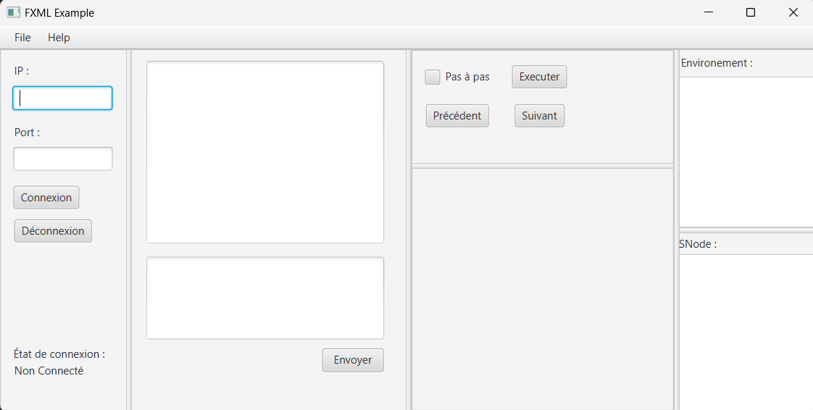
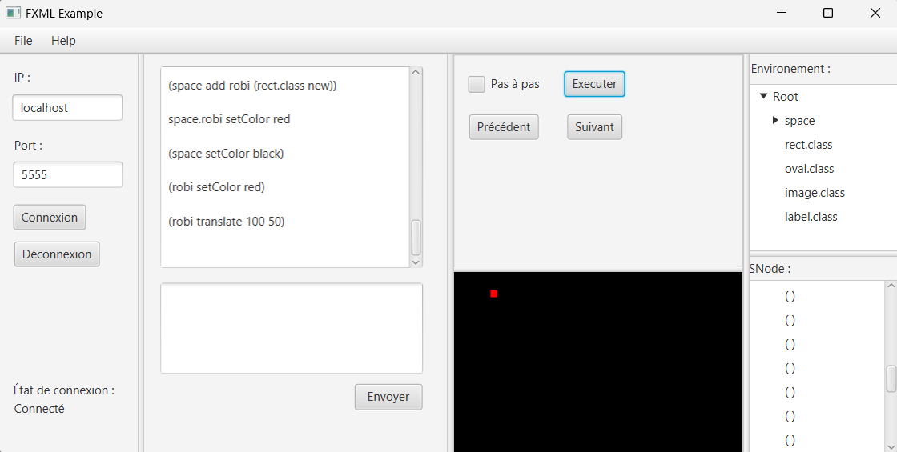

# Robi
Robi est composé de deux parties, la première est une série d'exercices sur la conception d'un interpréteur de commande, et la deuxième partie comprend un client-serveur intégrant cet interpréteur, accompagné d'une ihm permettant de saisir les commandes et de visualiser les éléments graphiques.

## Rendu
<a id="rendu" class="anchor"></a>
1. Partie 1: 
    Les exercices 1, 2.1, 2.2, 3, 4.1, 4.2 et 5 ont été rendu, notre version finale de l'interpréteur permet d'ajouter différents types d'éléments : rectangle, cercle, image, et label.
    Un élément peux être modifié et selon son type il possible de modifié plusieurs choses, sa position, sa couleur, ses dimensions.
    Chaque élément peux aussi contenir des éléments pour cela il faut utilisé une notation composé, exemple : space.robi.texte .
2. Partie 2:
    Les points 1, 2, 3 et 4 ont été rendu, notre version finale du client-serveur intègre l'interpréteur qui permet de faire toutes les commandes de la partie précédente.
    L'ihm réalisé avec la librairie JavaFx permet de saisir des commandes et visualiser graphiquement les commandes exécuté côté serveur.
    Tous les échanges entre le client et le serveur se font en json.
    À chaque exécution l'environnement affiché sous forme d'arbres dans l'ihm est mis à jour tout comme les snodes.


## Exemples





## Éléments Techniques
<a id="elementsTechniques" class="anchor"></a>
Nous avons choisi de créé des class spéciales pour le format Json elle porte le nom JSONFormat. De plus ont à créé des class Adapter qui gère la serialization/deserilization Json des class JSONFormat.

## Acquis

- **Création de socket**

     ```java
    /**
	 * Lance la connexion avec le serveur en initialisant le socket, le flux
	 * d'entrée et le flux de sortie.
	 * 
	 * @param serverAddress l'adresse IP du serveur
	 * @param port          le port de connexion du serveur
	 * @throws IOException si une erreur d'entrée/sortie survient lors de la
	 *                     création du socket ou des flux
	 */
	@Override
	public void startSocket(String serverAddress, int port) throws IOException {
		socket = new Socket(serverAddress, port);
		in = new ObjectInputStream(socket.getInputStream());
		out = new ObjectOutputStream(socket.getOutputStream());
	}
     ```

- **Gestion de Thread**

     ```java
    /**
     * Méthode exécutée lorsqu'un utilisateur clique sur le bouton de connexion.
     * Cette méthode vérifie si les champs d'entrée pour l'adresse IP et le port ne sont pas vides.
     * Si les champs ne sont pas vides, elle tente d'établir une connexion en utilisant les informations fournies.
     * Si la connexion réussit, elle lance un thread pour recevoir les messages entrants.
     * Elle met à jour l'état de la connexion et affiche "Connecté" dans le label correspondant.
     * En cas d'erreur lors de la connexion, elle affiche "erreur de connexion" dans le label.
     * Si le port spécifié n'est pas un entier valide, elle affiche "port non valide".
     * Si l'un des champs d'entrée est vide, elle affiche "entrée non valide".
     */
    @FXML
    private void actionBoutonConnexion() {
        if(entreeIp.getText()!=null && !entreeIp.getText().isEmpty() && entreePort.getText()!=null && !entreePort.getText().isEmpty()){
            try {
                super.startSocket(entreeIp.getText(),Integer.parseInt(entreePort.getText()));
                Thread receiveThread=new Thread(this::receiveMessage);
                myThread=receiveThread;
                IsConnected=true;
                receiveThread.start();
                labelEtatConnexion.setText("Connecté");
            } catch (IOException e) {
                labelEtatConnexion.setText("erreur de connexion");
            } catch (NumberFormatException e) {
                showError("port non valide");
            }
        }else{
            showError("entree non valide");
        }
    }
     ```
     
## Bilan
<a id="bilan" class="anchor"></a>
Dans l'interpréteur un oubli a été fait, lors de la suppression d'un élément ses enfants ne sont pas supprimés, visuellement l'élément et ses enfants sont bien supprimés mais environnement contient toujours les references des enfants.
L'exercice 6 de la partie 1 et le point 5 de la partie 2 n'ont pas été fait pas manque de temps.
<br>Nous avons choisi de créer une class pour faire tout les échanges de socket avec un nom, un type, un objet afin de faciliter la gestion des sockets et des objets echangés entre le client et le server.
## Auteurs
<a id="auteurs" class="anchor"></a>
- ROUSVAL Romain
- LE BRAS Erwan
- NICOLAS Pierre
- KERVRAN Maxime
